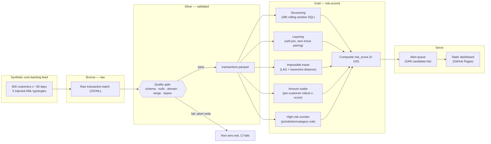

# AML Transaction Monitoring Pipeline

[](https://github.com/vabhishek8/aml-transaction-monitoring-pipeline/actions/workflows/pipeline.yml)

A rule-based transaction-monitoring pipeline that detects five real AML
typologies (structuring, layering, impossible-travel, statistical amount
outliers, high-risk-corridor routing) in a synthetic retail-banking
transaction feed — validated with case-level detection tests, not just
"it runs."

**[Live dashboard →](https://vabhishek8.github.io/aml-transaction-monitoring-pipeline/)**

Built as a companion to [azure-medallion-weather-pipeline](https://github.com/vabhishek8/azure-medallion-weather-pipeline),
deliberately aimed at banking/financial-services data engineering: the
detection logic is framed around what AML/BSA compliance actually requires,
and the Azure IaC is architected for what a bank's InfoSec review gates on
(no public network exposure, immutable audit storage, centralised
governance) rather than for minimum cost.

---

## Why this project exists

"I trained a fraud model on the Kaggle credit card dataset" doesn't
demonstrate banking-domain judgment — it demonstrates you can call
`.fit()`. This project is scoped around the questions a transaction-
monitoring engineer actually has to answer:

- What does *evidence* look like for a detection rule, when there's no
  ground-truth label in production?
- How do you validate a rule catches the pattern it's designed for, without
  drowning downstream investigators in false positives?
- Where does regulatory record-keeping (immutability, lineage, retention)
  become a data-architecture requirement, not a compliance afterthought?

No real transaction data is used or could be — it doesn't exist publicly,
correctly. Instead, `src/generate_transactions.py` synthesizes a realistic
transaction batch and *deliberately injects* five known AML typologies with
a recorded ground truth, so the detection SQL (`src/gold.py`) can be
validated the same way a real transaction-monitoring team validates new
rules before they ever see production data: known-scenario injection,
measured recall and false-positive rate.

---

## Architecture



Each detection signal is independently unit-tested against the injected
ground truth in `tests/test_gold.py` — and that test file is the part of
this repo worth reading first.

## Detection quality (measured, not asserted)

Recall is measured **at the case level**: did the scheme trigger an alert
on *any* of its transactions? A real monitoring system alerts once a
pattern has enough evidence, not retroactively on every leg of it — testing
row-level recall would be testing the wrong thing.

| Typology | Case-level recall | Notes |
|---|---|---|
| Structuring | 100% | Flags once cumulative sub-CTR-threshold deposits cross ~90% of AUD 10,000 within a rolling 48h window |
| Layering | 100% | Self-join pairs a wire-in with a same-customer wire-out of similar magnitude within 6h |
| Impossible travel | 100% | Haversine distance / elapsed time vs. the customer's immediately prior transaction, thresholded above commercial flight speed |
| Amount outlier | 100% | Per-customer **median/MAD** z-score — see below, this replaced a naive mean/stddev version |
| High-risk corridor | 100% | Deterministic jurisdiction/merchant-category rule |

False-positive rate on clean (non-injected) transactions: **7.9%** overall,
but 86% of those "false positives" are `high_risk_corridor` firing correctly
on genuinely high-risk-jurisdiction transactions that simply weren't part of
a designed scenario — not errors. The `impossible_travel` rule contributes
a real, explainable ~1.5% incidental false-positive rate, driven by
uniformly-random synthetic timestamps occasionally clustering by chance;
in production this would be tightened against actual customer travel
history and card-present authentication signals, not tuned against a
synthetic artifact.

### A real bug this caught: outlier detection measured against its own outlier

The first version of `amount_outlier` used a per-customer mean/stddev
z-score. Recall was 20% — because the outlier transaction itself inflates
the sample stddev it's being measured against, worst for customers with
few transactions (small-n Bessel correction amplifies the effect). Switching
to a **median/MAD (median absolute deviation)** robust statistic — resistant
to a small number of extreme values contaminating the baseline — took
recall from 20% to 100% with the false-positive rate on clean data at
0.01%. `tests/test_gold.py::test_amount_outlier_uses_robust_stat_not_skewed_by_own_outlier`
is a regression guard specifically for this failure mode, targeted at
low-transaction-count customers where it would resurface first.

---

## Production Azure mapping

`infra/main.bicep` translates the same bronze/silver/gold design to a
governed Azure estate — but the architecture decisions here are different
from a generic "deploy to Azure" template, because the data class is
different:

| Decision | Reasoning |
|---|---|
| No public network access anywhere (storage, Key Vault, ADF, Synapse) | Every data-bearing service sits behind a private endpoint in a dedicated VNet. This is the default posture a bank's InfoSec review expects, not an opt-in hardening step. |
| Account-level immutable storage with versioning | Transaction records and the alerts derived from them need a defensible chain of custody — AML/CTF Act and SAR record-keeping obligations are a data-architecture requirement, not just a policy document. |
| Microsoft Purview | Centralised lineage/classification across bronze → silver → gold. BCBS 239's risk-data-aggregation principles are fundamentally about provable data lineage and ownership, not modelling accuracy. |
| RBAC-authorized Key Vault, purge protection on, 90-day soft-delete | No legacy access policies; every identity is granted the minimum role (`Key Vault Secrets User`, `Storage Blob Data Contributor`) scoped to a single resource. |
| Synapse **managed virtual network** | Compute-to-storage traffic never traverses the public internet, even for intra-service calls. |
| 365-day Log Analytics retention in prod (vs. 60-day ops-only baseline) | This is an audit trail, not just operational telemetry. |
| Not deployed and left running | A standing environment holding transaction-shaped data (even synthetic) with no active monitoring owner is itself a finding in most banking security reviews — same cost-discipline argument as the companion weather-pipeline project, with a compliance angle added. |

Validated with `bicep build` (0 errors, 25 resources). Deploy on demand:

```bash
az deployment group create \
  --resource-group rg-aml-pipeline-dev \
  --template-file infra/main.bicep \
  --parameters environment=dev alertEmail=you@example.com
```

---

## Running locally

```bash
python -m venv .venv && source .venv/bin/activate
pip install -r requirements.txt
python src/pipeline.py           # generate -> silver -> gold -> dashboard
PYTHONPATH=src pytest tests/ -v  # 29 tests: quality gate, generator invariants, detection recall/FP rate
open docs/index.html
```

## Repo layout

```
src/
  generate_transactions.py   synthetic core-banking feed, 5 injected AML typologies with recorded ground truth
  quality_checks.py           the silver quality gate
  transform.py                 bronze -> silver: parse, validate, dedupe
  gold.py                       risk-scoring SQL: structuring, layering, impossible travel, outlier, corridor
  dashboard.py                   renders gold -> static Plotly HTML (risk distribution, alert queue)
  pipeline.py                     orchestrates all four stages
tests/                          29 pytest cases -- including case-level recall/FP-rate assertions against ground truth
infra/main.bicep                production Azure IaC: private-endpoint-only, immutable storage, Purview, RBAC
.github/workflows/               scheduled CI: test -> run -> commit refreshed gold data
```

## Stack

Python · pandas · DuckDB (window functions, self-joins, haversine SQL) · Plotly · pytest ·
GitHub Actions · Bicep (VNet + private endpoints, ADLS Gen2 immutable storage, Key Vault RBAC,
Azure Data Factory, Synapse managed VNet, Microsoft Purview, Log Analytics)

---

Built by [Abhishek Vadlamudi](https://abhishekvadlamudi.com) — Senior BI Engineer
positioning toward Azure Data Engineering in financial services.
